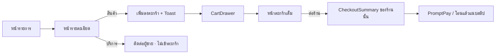

# 05 · ตะกร้าและการชำระเงิน

**ชั้น 04** · Marketplace Patterns

กฎโดเมนของเส้นทางซื้อ — ตัวไหนเข้าตะกร้าได้ · ใครเป็นเจ้าของยอด · ใครต้องเข้าสู่ระบบเมื่อไร

เอกสารนี้มีอยู่เพื่อให้ **แอปไม่ต้องคิดกฎเหล่านี้เอง** · component ในชั้น 03 บังคับกฎส่วนใหญ่ไว้ด้วย type แล้ว แต่การประกอบยังต้องรู้ที่มา

---

## 1 · เส้นทางเดียวของผู้ซื้อ



ทุกกล่องในแผนภาพประกอบจาก `@smego/ui` ได้โดยไม่ต้องเขียน UI นอกระบบ

---

## 2 · สินค้าเข้าตะกร้า · บริการไม่เข้า

| | สินค้า | บริการ |
|---|---|---|
| CTA ในหน้ารายละเอียด | **เพิ่มลงตะกร้า** | **ติดต่อผู้ขาย / ขอใบเสนอราคา** |
| มีสต็อก | ใช่ | ไม่ |
| ค่าขนส่ง | มี | ไม่มี |
| ราคานิ่งก่อนคุย | นิ่ง | **ไม่นิ่ง** |

### ★★★ ทำไมบริการเข้าตะกร้าไม่ได้

`CheckoutSummary` คำนวณ VAT และค่าขนส่งจากยอดในตะกร้า · ถ้ายอดนั้นยังไม่นิ่งเพราะขอบเขตงานยังไม่ตกลง ตัวเลขที่ผู้ซื้อเห็นคือ **ตัวเลขที่ผิด** ซึ่งเรื่องเงินไม่ใช่แค่ UX ที่ไม่สวย

[`<BuyBox kind>`](../03-components/src/marketplace/BuyBox.md) บังคับข้อนี้ด้วย type — ไม่มีค่าเริ่มต้นให้เผลอ

---

## 3 · ตะกร้าเดียว หลายร้าน · ชำระแยกร้าน

**ตะกร้าเก็บของหลายร้านในใบเดียว** เพราะผู้ซื้อ B2B เทียบผู้ขายหลายเจ้าในรอบเดียว — ตะกร้าต่อร้านบังคับให้เคลียร์ของเก่าทิ้ง ซึ่งขัดกับ `Compare` และ `Wishlist` ที่ระบบมีอยู่แล้ว

**แต่การชำระเงินแยกร้าน** เพราะเงินเข้าบัญชีผู้ขายโดยตรง (พร้อมเพย์ · โอนแล้วแนบสลิป) ไม่ได้ผ่าน gateway รวมศูนย์

| หน่วย | เจ้าของ |
|---|---|
| ตะกร้า | ผู้ซื้อ |
| **กลุ่มร้าน** | **คำสั่งซื้อหนึ่งใบ · ยอดหนึ่งยอด · การโอนหนึ่งครั้ง · สลิปหนึ่งใบ** |
| รายการ | สินค้าหนึ่งชนิด |

ผลต่อโครงสร้าง: `CartSellerGroup` ถือ **ยอดรวมและปุ่มชำระ** · ตะกร้า **ไม่มี** "ยอดรวมทั้งตะกร้า" ให้กดชำระ โดยตั้งใจ

⚠️ คำเตือนว่าจะต้องโอนหลายครั้งอยู่ **ในตะกร้า** ไม่ใช่ในหน้าชำระเงิน — ผู้ซื้อที่รู้ตอนหน้าชำระเงินคือผู้ซื้อที่รู้สายเกินไป

---

## 4 · แขกใส่ตะกร้าได้ · ตัวตนจำเป็นตอนชำระเงิน

| ขั้น | ต้องเข้าสู่ระบบ |
|---|---|
| ค้นหา · ดูรายละเอียด · เทียบ | ไม่ |
| **เพิ่มลงตะกร้า · แก้จำนวน** | **ไม่** |
| บันทึกไว้ดูภายหลัง | ใช่ (ผูกกับบัญชี) |
| **ชำระเงิน** | **ใช่** |

การขอตัวตนก่อนให้คุณค่าคือจุดที่ผู้ซื้อออกจากหน้า · `CartList isGuest` บอกล่วงหน้าว่า **ของในตะกร้าจะยังอยู่** เพื่อไม่ให้ผู้ใช้ตกใจตอนเจอหน้าเข้าสู่ระบบ

⚠️ หลังเข้าสู่ระบบต้องพากลับมา **ที่เดิม** ไม่ใช่หน้าแรก — นี่เป็นหน้าที่ของแอป component บังคับให้ไม่ได้

---

## 5 · ใครพูดอะไร

| เหตุการณ์ | ใช้ | ทำไม |
|---|---|---|
| เพิ่มลงตะกร้าสำเร็จ | [`showToast`](../03-components/src/feedback/Toast.md) | ยืนยันสิ่งที่เห็นผลแล้ว (ตัวเลขบนไอคอนตะกร้าเปลี่ยน) |
| เพิ่มลงตะกร้าไม่สำเร็จ | `<Alert tone="danger" isLive>` ใน `BuyBox` | ต้องอ่านจบก่อนหาย |
| ตะกร้ามีหลายร้าน | `<Alert tone="info">` ใน `CartList` | เป็นเงื่อนไขที่ต้องรู้ก่อนกดชำระ |
| ยืนยันคำสั่งซื้อไม่สำเร็จ | `<Alert isLive>` ใน `CheckoutSummary` | เดียวกัน |
| ผู้ขายไม่จด VAT | `<Alert tone="warning">` | ต้นทุนจริงต่าง 7% |

**ไม่มีเหตุการณ์ใดในเส้นทางนี้ที่ใช้ toast แจ้ง error** — เส้นแบ่งอยู่ใน [`Alert.md`](../03-components/src/feedback/Alert.md)

---

## 6 · โครงมาตรฐานของหน้าตะกร้า

```tsx
<Container size="narrow">
  <h1 className="text-heading-sm text-fg">{s.cart.title}</h1>

  <CartList
    itemCount={items.length}
    sellerCount={groups.length}
    isGuest={!user}
    emptyAction={<Link href="/products">{s.cart.continueShopping}</Link>}
  >
    {groups.map((g) => (
      <CartSellerGroup
        key={g.sellerId}
        sellerName={g.sellerName}
        subtotal={g.subtotal}
        headingLevel={2}
        onCheckout={() => router.push(`/checkout/${g.sellerId}`)}
      >
        {g.items.map((item) => <CartLineItem key={item.id} {...item} />)}
      </CartSellerGroup>
    ))}
  </CartList>
</Container>
```

### ★ สามข้อที่ผิดบ่อยที่สุดในโครงนี้

1. **`headingLevel={2}` บนกลุ่มร้าน** เมื่อหน้ามี `<h1>` — ค่าเริ่มต้นคือ `3` ซึ่งจะข้ามระดับ 2 และ axe จับเป็น `heading-order`
2. **ปุ่มชำระอยู่ที่กลุ่มร้าน ไม่ใช่ท้ายหน้า** — ยอดรวมทั้งตะกร้าไม่ใช่ยอดที่จ่ายได้จริง
3. **`<main id="main">` ต้องมี** เพราะลิงก์ข้ามใน `AppHeader` ชี้มาที่นี่

---

## 7 · โครงมาตรฐานของหน้าชำระเงิน (ต่อร้าน)

```tsx
<CheckoutStepper currentIndex={step} steps={steps} />

<CheckoutSummary
  itemCount={group.items.length}
  subtotal={group.subtotal}
  vat={group.subtotal * 0.07}
  shipping={address ? shipping : null}
  total={group.total}
  onSubmit={placeOrder}
  isSubmitting={isSubmitting}
  isSubmitDisabled={!address}
  errorMessage={error}
/>

<PaymentMethodSelect … />
<PromptPayQR … />   {/* หรือ <SlipUpload> */}
```

ยอดใน QR คือยอดของ **ร้านนี้ร้านเดียว** — เลขอ้างอิงต้องผูกกับคำสั่งซื้อใบนั้น ไม่ใช่กับตะกร้า

---

## 8 · สิ่งที่ยังไม่อยู่ในรอบนี้

| | สถานะ |
|---|---|
| ฝั่งผู้ขาย (รับออเดอร์ · ยืนยันสลิป) | ยังไม่ทำ |
| เครดิตเทอมและวงเงินผู้ซื้อ | มี `PaymentMethodSelect` แต่ยังไม่มี flow อนุมัติ |
| คูปอง / ส่วนลดข้ามร้าน | ยังไม่ทำ — `extraLines` รองรับส่วนลดต่อร้านแล้ว |
| ชั้น 05 Templates | ไม่ทำ — แอปประกอบหน้าเอง |
| `EmptyState` · `Pagination` เป็น component | ยังไม่ทำ · `CartList` มีสถานะว่างในตัว |
